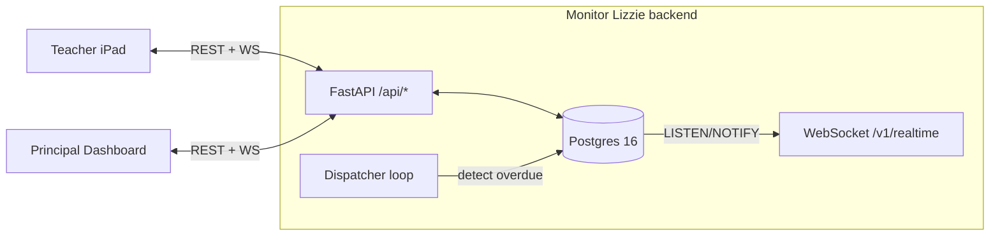

# Monitor Lizzie

Digital hall-pass tracker for K-12. Demo software — no real student data.

Two views, both backed by one FastAPI service:

- **Teacher iPad app** (`frontend/`) — sign in as a teacher, pick today's class, see the live roster, issue and return restroom / nurse / office passes.
- **Principal dashboard** (`frontend-dashboard/`) — sign in as the principal, see who's out, who's overdue, and a live alert feed via WebSocket.

There's no LLM, no phone-call agent, no policy RAG. The MVP is the bathroom-monitoring loop and nothing else. Earlier hackathon code carried all three; it lives on `legacy/voice-agent` and `legacy/parent-comms-integration` if you want the archaeology.



## Prerequisites

| Tool | Version | Install |
|---|---|---|
| Python | 3.12+ | `brew install python@3.12` · `pyenv install 3.12` · `asdf install` |
| Node.js | 20+ | `brew install node@20` · `nvm install 20` |
| Docker Engine + Compose v2 | 20.10+ | [Docker Desktop](https://www.docker.com/products/docker-desktop/) · `apt install docker.io docker-compose-plugin` |
| Postgres 16 | — | Pulled automatically as `postgres:16` via docker compose |

No OpenAI key, no API tokens, no SSO setup. Demo mode runs offline.

## Quick start

```bash
git clone <repo> && cd hallPassAttendanceOfficer
cp .env.example .env                            # defaults are fine for local dev

make install                                    # creates .venv, pip install -e ".[dev]", pre-commit
docker compose up -d db                         # Postgres 16 on :5432
.venv/bin/alembic upgrade head                  # runs migrations 0001 → 0010
.venv/bin/python -m lizzie.cli.seed             # Lincoln High + Ms. Rivera + Dr. Chen + 12 students
.venv/bin/uvicorn --factory lizzie.app:app_factory --reload --port 8000
```

Then in two more terminals:

```bash
cd frontend && npm install && npm run dev        # Vite on :3000
```

```bash
cd frontend-dashboard && npm install && npm run dev    # Vite on :3100
```

Open:
- Teacher iPad: <http://localhost:3000/> → click **Teacher** to sign in as Ms. Rivera.
- Principal dashboard: <http://localhost:3100/> → click **Principal** to sign in as Dr. Chen.
- Swagger: <http://localhost:8000/docs>

If your machine already has Postgres on 5432, drop a local-only `docker-compose.override.yml` (already gitignored) to remap to 5433 and edit `.env` accordingly. See [CLAUDE.md → Local port collisions](./CLAUDE.md#local-port-collisions).

## Demo flow

1. **Issue a pass.** On the iPad app, pick today's class (Algebra I, English, or Biology), tap a student, choose RESTROOM, confirm. The pass appears under "Out now" on both the iPad and the principal dashboard within a second over WebSocket.
2. **Watch the timer.** Default duration is 15 minutes; for the live demo set `duration_minutes=1` when issuing or run the dispatcher with `DISPATCHER_INTERVAL_SECONDS=5`.
3. **See the alert.** When the pass goes overdue, the dispatcher inserts an `Alert` row and `alert.raised` flows over WebSocket. The dashboard's Live Activity panel updates.
4. **Check it back in.** Tap the pass on the iPad → returned. Audit rows for every mutation land in the `audit_log` table.

## Tech stack

- Python 3.12, FastAPI, SQLAlchemy 2.0 async, Alembic, Pydantic v2
- PostgreSQL 16 (no pgvector); real-time via `LISTEN/NOTIFY` → WebSockets
- React 18 + Vite, TypeScript, Tailwind, React Router (teacher app)
- pytest + testcontainers for integration tests, ruff, mypy strict, pre-commit
- Deployment: backend on Railway, both frontends on Netlify

## Auth

Demo-only role-picker. The landing page on each frontend shows two buttons (Teacher / Principal); clicking one signs you in as the corresponding seeded user via an HMAC-signed cookie. No passwords, no Google SSO.

The architecture is deliberately a single seam — when a real Texas school pilot wants Google OIDC, you replace the `current_user` dependency in `src/lizzie/auth/dependencies.py` and every protected route works unchanged.

## Make targets

```
make install         # python -m venv .venv && pip install -e ".[dev]" && pre-commit install
make test            # full suite (Docker required for integration)
make test-unit       # unit only — no Docker needed
make test-integration
make lint
make fmt
make type            # mypy
make db-up           # docker compose up -d db
make db-down         # docker compose down -v
make hooks           # pre-commit run --all-files
make clean
```

## Deployed

- Teacher iPad: <https://verdant-pie-1d3c9f.netlify.app/>
- Principal dashboard: <https://dashboardfrontendadmin.netlify.app/>
- Backend: Railway (`https://*.up.railway.app`); see `railway.json`

## More

- Architecture, env vars, data model, API surface: see [CLAUDE.md](./CLAUDE.md).
- Cutover history from the hackathon-era HPAO codebase: `git log --oneline mvp-hall-monitor`.
